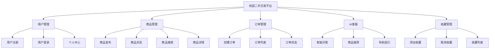
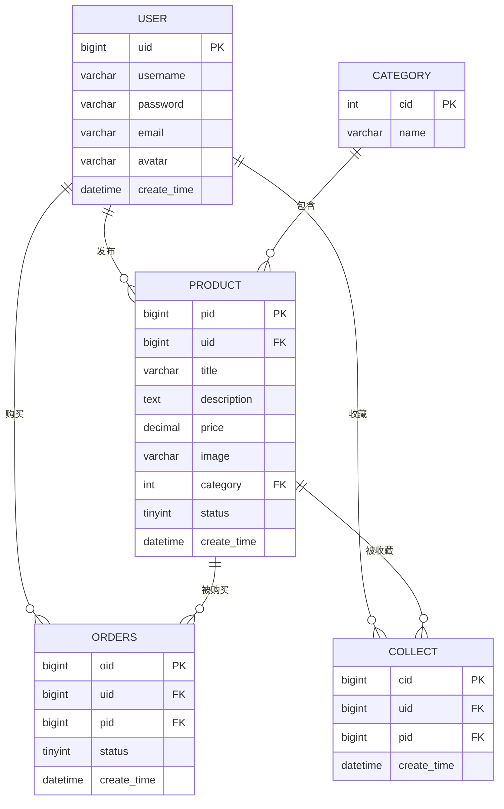

# 武汉大学实验报告

**专 业 名 称**：计算机科学与技术  
**课 程 名 称**：  
**指 导 教 师**：  
**学 生 学 号**：  
**学 生 姓 名**：  

**二○二六年五月**

---

## 郑重声明

本人呈交的设计报告，是在指导老师的指导下，独立进行实验工作所取得的成果，所有数据、图片资料真实可靠。尽我所知，除文中已经注明引用的内容外，本设计报告不包含他人享有著作权的内容。对本设计报告做出贡献的其他个人和集体，均已在文中以明确的方式标明。本设计报告的知识产权归属于培养单位。

本人签名：_______________  
日期：2026年5月27日

---

## 摘要

本实验报告设计并实现了一个**校园二手交易平台**，旨在为在校学生提供便捷的二手物品交易服务。系统采用前后端分离架构，前端基于Vue.js 3构建用户界面，后端使用Spring Boot框架提供RESTful API，数据库采用MySQL存储数据。主要功能包括用户注册登录、商品发布与浏览、商品搜索、订单管理、收藏功能以及AI智能客服。本报告从实验目的、需求分析、系统设计、实现过程等方面进行详细阐述。

**关键词**：校园二手交易；Vue.js；Spring Boot；AI客服；RAG技术

---

## 目录

1. [概述](#第1章-概述)
    - [选题背景](#11-选题背景)
    - [分组及分工](#12-分组及分工)
2. [系统需求分析](#第2章-系统需求分析)
    - [引言](#21-引言)
    - [功能需求](#22-功能需求)
    - [非功能需求](#23-非功能需求)
    - [技术选型](#24-技术选型)
    - [其他要求](#25-其他要求)
3. [系统设计](#第3章-系统设计)
    - [引言](#31-引言)
    - [系统功能设计](#32-系统功能设计)
    - [系统UI设计](#33-系统ui设计)
    - [系统详细设计](#34-系统详细设计)
    - [数据库设计](#35-数据库设计)
4. [系统实现](#第4章-系统实现)
    - [引言](#41-引言)
    - [系统典型界面](#42-系统典型界面)
    - [测试计划](#43-测试计划)
    - [测试报告](#44-测试报告)
5. [总结](#第5章-总结)

---

## 第1章 概述

### 1.1 选题背景

随着高校学生人数的增加，二手物品交易需求日益增长。传统的线下交易方式存在信息不对称、交易效率低等问题。本项目旨在开发一个基于Web的校园二手交易平台，为学生提供便捷、安全的二手交易服务。平台采用Vue.js 3 + Spring Boot技术栈，集成AI智能客服功能，提升用户体验。

### 1.2 分组及分工

| 姓名 | 学号 | 负责模块 |
|------|------|----------|
| XXX | XXX | 前端页面开发、UI设计 |
| XXX | XXX | 后端API开发、数据库设计 |
| XXX | XXX | AI客服模块、RAG技术集成 |

---

## 第2章 系统需求分析

### 2.1 引言

本系统为校园二手交易平台，旨在解决学生之间二手物品交易的痛点，提供安全、便捷、高效的交易环境。系统需求包括用户管理、商品管理、订单管理、AI智能客服等核心功能。

### 2.2 功能需求

#### 2.2.1 用户管理模块
- **用例图**：用户注册、登录、个人信息管理
- **功能描述**：
  - 用户注册：支持用户名、密码、邮箱注册
  - 用户登录：账号密码登录，JWT令牌验证
  - 个人中心：查看/修改个人信息、头像上传

#### 2.2.2 商品管理模块
- **用例图**：商品发布、浏览、搜索、详情查看
- **功能描述**：
  - 商品发布：标题、描述、价格、图片上传
  - 商品浏览：首页展示、分类浏览
  - 商品搜索：关键词搜索、分类筛选
  - 商品详情：查看商品信息、联系卖家

#### 2.2.3 订单管理模块
- **用例图**：创建订单、订单列表、订单状态管理
- **功能描述**：
  - 创建订单：选择商品、确认交易
  - 订单列表：查看已买/已卖订单
  - 订单状态：待付款、已付款、已完成

#### 2.2.4 AI客服模块
- **用例图**：智能问答、商品推荐、导航指引
- **功能描述**：
  - 智能问答：基于RAG技术的商品相关问答
  - 商品推荐：根据用户历史推荐相似商品
  - 导航指引：智能跳转到相关页面

#### 2.2.5 收藏管理模块
- **用例图**：添加收藏、取消收藏、收藏列表
- **功能描述**：
  - 添加/取消收藏：一键收藏商品
  - 收藏列表：查看已收藏商品

### 2.3 非功能需求

| 需求类型 | 描述 |
|----------|------|
| **性能需求** | 页面响应时间≤2秒，支持100+并发用户 |
| **安全性** | 用户密码加密存储，JWT安全认证，防止SQL注入 |
| **可用性** | 系统可用性≥99%，支持7×24小时运行 |
| **兼容性** | 支持主流浏览器（Chrome、Firefox、Edge） |
| **可扩展性** | 模块化设计，便于后续功能扩展 |

### 2.4 技术选型

| 层次 | 技术 | 版本 | 选型理由 |
|------|------|------|----------|
| **前端框架** | Vue.js | 3.5.30 | 响应式设计，生态成熟，开发效率高 |
| **UI组件库** | Element Plus | 2.13.6 | 丰富的组件，美观的界面设计 |
| **路由管理** | Vue Router | 4.6.4 | Vue官方路由，支持单页应用 |
| **后端框架** | Spring Boot | 4.0.4 | 社区成熟，自动配置简化开发 |
| **数据库** | MySQL | 8.0 | 开源稳定，适合中小型项目 |
| **ORM框架** | MyBatis | 4.0.1 | SQL灵活可控，性能优秀 |
| **认证方式** | JWT | 0.12.6 | 无状态认证，便于水平扩展 |
| **AI服务** | DeepSeek + SiliconFlow | - | 双API支持，提高可靠性 |

### 2.5 其他要求

- 支持暗色模式切换
- 响应式设计，适配不同屏幕尺寸
- 图片上传支持预览
- 支持环境变量配置敏感信息

---

## 第3章 系统设计

### 3.1 引言

本系统采用前后端分离架构，前端负责界面展示和用户交互，后端负责业务逻辑和数据处理，通过RESTful API进行通信。

### 3.2 系统功能设计



### 3.3 系统UI设计

#### 3.3.1 设计风格
- **主色调**：蓝色系（#1890ff），体现清新、专业的校园风格
- **辅助色**：灰色系用于文字和边框
- **布局**：响应式布局，支持PC端和移动端

#### 3.3.2 页面结构
| 页面 | 功能描述 | 设计要点 |
|------|----------|----------|
| **首页** | 商品列表展示 | 瀑布流布局，分类筛选，搜索框 |
| **登录/注册** | 用户认证 | 简洁表单，错误提示 |
| **商品详情** | 商品信息展示 | 图片轮播，价格显示，购买按钮 |
| **发布商品** | 商品发布表单 | 图片上传，表单验证 |
| **个人中心** | 用户信息管理 | 订单统计，个人资料 |
| **AI聊天** | 智能客服 | 对话界面，支持表情 |

### 3.4 系统详细设计

#### 3.4.1 前端架构

```
src/
├── views/          # 页面组件
│   ├── Home.vue    # 首页
│   ├── Login.vue   # 登录页
│   ├── ProductDetail.vue  # 商品详情
│   └── ...
├── components/     # 公共组件
│   ├── Header.vue  # 头部导航
│   ├── Footer.vue  # 底部
│   └── AIChat.vue  # AI客服组件
├── router/         # 路由配置
├── utils/          # 工具函数
│   ├── request.js  # HTTP请求封装
│   └── images.js   # 图片处理
├── App.vue         # 根组件
└── main.js         # 入口文件
```

#### 3.4.2 后端架构

```
src/main/java/
├── controller/     # REST API控制层
│   ├── UserController.java
│   ├── ProductController.java
│   ├── OrdersController.java
│   └── ChatController.java
├── service/        # 业务逻辑层
│   ├── impl/       # 实现类
│   └── *.java      # 接口定义
├── mapper/         # 数据访问层（MyBatis）
├── entity/         # 数据库实体
├── config/         # 配置类
├── util/           # 工具类
│   └── JwtUtil.java
└── Application.java  # 启动类
```

#### 3.4.3 核心接口设计

| 模块 | 接口 | 方法 | 功能 |
|------|------|------|------|
| **用户** | `/user/register` | POST | 用户注册 |
| **用户** | `/user/login` | POST | 用户登录 |
| **商品** | `/product/list` | GET | 获取商品列表 |
| **商品** | `/product/add` | POST | 发布商品 |
| **商品** | `/product/search` | GET | 搜索商品 |
| **订单** | `/orders/create` | POST | 创建订单 |
| **订单** | `/orders/list` | GET | 获取订单列表 |
| **收藏** | `/collect/add` | POST | 添加收藏 |
| **收藏** | `/collect/list` | GET | 获取收藏列表 |
| **聊天** | `/chat/rag` | POST | AI智能问答 |

#### 3.4.4 用户认证模块设计

**认证方案**：采用 JWT（JSON Web Token）无状态认证机制

**安全性设计**：
- 密码存储：使用 BCrypt 哈希算法加密（10次迭代），避免明文存储
- Token 结构：包含 uid（用户ID）、username（用户名）、exp（过期时间）三个字段
- 有效期：Token 有效期设置为 24 小时，过期后需重新登录
- 传输安全：Token 通过 HTTP 请求头的 Authorization 字段传输，格式为 `Bearer <token>`

**设计优势**：
- 无状态设计：服务器无需存储 Session，便于系统水平扩展
- 跨域支持：Token 可在不同域名间传递，支持前后端分离架构
- 单点登录：一套 Token 可用于多个服务的认证

**认证流程**：
```
用户登录 → 验证用户名密码 → 生成JWT Token → 返回Token给前端
                ↓
后续请求 → 前端携带Token → 后端验证Token → 处理请求
```

#### 3.4.5 AI智能客服模块设计

**技术方案**：基于 RAG（Retrieval-Augmented Generation）技术实现智能问答

**核心流程**：
1. **用户提问**：用户在聊天界面输入问题
2. **向量嵌入**：调用 SiliconFlow API 将问题转换为 384 维向量
3. **相似度匹配**：计算问题向量与商品库中商品向量的余弦相似度
4. **上下文构建**：结合用户已发布商品、已收藏商品信息构建对话上下文
5. **AI回复**：调用 DeepSeek API 生成基于上下文的智能回复
6. **智能导航**：从回复中提取商品ID，生成页面跳转链接

**算法设计**：
- 相似度算法：采用余弦相似度算法，计算公式为 `cosθ = (A·B) / (||A|| × ||B||)`
- 阈值设置：相似度阈值设为 0.7，高于阈值的商品才作为上下文
- 结果数量：取 Top-3 最相似商品作为上下文输入给 AI

**双API设计**：
- 主 API：DeepSeek，用于生成智能回复
- 备用 API：SiliconFlow，用于向量嵌入和降级使用
- 故障切换：当主 API 不可用时，自动切换到备用 API，提高系统可靠性

**对话历史管理**：
- 使用 ConcurrentHashMap 存储每个用户的对话历史
- 最多保存最近 10 条对话，超出时自动删除最早的记录
- 对话历史用于上下文理解，提升对话连贯性

#### 3.4.6 商品管理模块设计

**商品发布流程**：
```
用户上传图片 → 后端保存图片 → AI内容检测 → 检测通过 → 保存商品信息
                              ↓
                         检测失败 → 返回错误提示
```

**图片上传设计**：
- 文件接收：使用 Spring MultipartFile 接收上传文件
- 文件命名：UUID 重命名，避免文件名冲突和安全问题
- 文件存储：本地文件系统存储，存储路径通过配置文件管理
- 静态映射：通过 `addResourceHandlers` 将 `/files/**` 映射到存储目录

**AI内容检测设计**：
- 检测时机：商品发布前进行检测
- 检测内容：商品标题和描述
- 检测接口：调用外部 AI 内容安全检测接口
- 处理策略：检测不通过则拒绝发布，返回明确的错误提示

**商品状态设计**：
| 状态码 | 状态名称 | 说明 |
|--------|----------|------|
| 0 | 在售 | 商品正常展示，可被购买 |
| 1 | 已卖出 | 商品已被购买，不再展示 |
| 2 | 已下架 | 卖家主动下架，不再展示 |

#### 3.4.7 订单管理模块设计

**订单状态流转**：
```
待付款(0) → 已付款(1) → 已完成(2)
   ↓
  取消(-1)
```

**状态转换规则**：
- 待付款 → 已付款：用户完成支付
- 已付款 → 已完成：卖家确认交易完成
- 待付款 → 取消：用户取消订单或超时未付款

**订单创建流程**：
1. 验证商品状态：确保商品处于在售状态
2. 创建订单记录：保存买家ID、商品ID、订单状态
3. 返回订单信息：包含订单ID、商品信息、总价

**并发处理设计**：
- 使用数据库事务保证数据一致性
- 商品库存检查：创建订单时检查商品状态
- 乐观锁机制：防止超卖问题

### 3.5 数据库设计

#### 3.5.1 数据库表结构

**表1：用户表（user）**

| 字段名 | 类型 | 约束 | 说明 |
|--------|------|------|------|
| uid | BIGINT | PRIMARY KEY, AUTO_INCREMENT | 用户ID |
| username | VARCHAR(50) | NOT NULL, UNIQUE | 用户名 |
| password | VARCHAR(255) | NOT NULL | 密码（BCrypt加密） |
| email | VARCHAR(100) | UNIQUE | 邮箱 |
| avatar | VARCHAR(255) | | 头像URL |
| create_time | DATETIME | DEFAULT CURRENT_TIMESTAMP | 创建时间 |

**表2：商品表（product）**

| 字段名 | 类型 | 约束 | 说明 |
|--------|------|------|------|
| pid | BIGINT | PRIMARY KEY, AUTO_INCREMENT | 商品ID |
| uid | BIGINT | NOT NULL, FOREIGN KEY | 卖家ID |
| title | VARCHAR(100) | NOT NULL | 商品标题 |
| description | TEXT | | 商品描述 |
| price | DECIMAL(10,2) | NOT NULL | 商品价格 |
| image | VARCHAR(255) | | 商品图片URL |
| category | INT | NOT NULL | 商品分类ID |
| status | TINYINT | DEFAULT 0 | 状态（0在售/1已卖出/2已下架） |
| create_time | DATETIME | DEFAULT CURRENT_TIMESTAMP | 创建时间 |

**表3：订单表（orders）**

| 字段名 | 类型 | 约束 | 说明 |
|--------|------|------|------|
| oid | BIGINT | PRIMARY KEY, AUTO_INCREMENT | 订单ID |
| uid | BIGINT | NOT NULL, FOREIGN KEY | 买家ID |
| pid | BIGINT | NOT NULL, FOREIGN KEY | 商品ID |
| status | TINYINT | DEFAULT 0 | 状态（0待付款/1已付款/2已完成） |
| create_time | DATETIME | DEFAULT CURRENT_TIMESTAMP | 创建时间 |

**表4：收藏表（collect）**

| 字段名 | 类型 | 约束 | 说明 |
|--------|------|------|------|
| cid | BIGINT | PRIMARY KEY, AUTO_INCREMENT | 收藏ID |
| uid | BIGINT | NOT NULL, FOREIGN KEY | 用户ID |
| pid | BIGINT | NOT NULL, FOREIGN KEY | 商品ID |
| create_time | DATETIME | DEFAULT CURRENT_TIMESTAMP | 创建时间 |

**表5：分类表（category）**

| 字段名 | 类型 | 约束 | 说明 |
|--------|------|------|------|
| cid | INT | PRIMARY KEY, AUTO_INCREMENT | 分类ID |
| name | VARCHAR(50) | NOT NULL, UNIQUE | 分类名称 |

#### 3.5.2 ER图



---

## 第4章 系统实现

### 4.1 引言

本系统已完成核心功能的开发与测试，包括用户认证、商品管理、订单管理、AI客服等模块。以下对系统实现进行详细说明。

### 4.2 系统典型界面

#### 4.2.1 首页界面
- **功能**：展示商品列表、分类筛选、搜索功能
- **设计**：响应式卡片布局，支持暗色模式切换
- **截图说明**：顶部导航栏、商品搜索框、分类标签、商品卡片网格

#### 4.2.2 商品详情页
- **功能**：展示商品详细信息、图片轮播、购买按钮
- **设计**：左侧图片展示区、右侧商品信息区、底部操作按钮
- **截图说明**：商品图片、标题、价格、描述、卖家信息

#### 4.2.3 AI客服界面
- **功能**：智能问答、商品推荐、页面导航
- **设计**：底部聊天输入框、消息列表、快捷操作按钮
- **截图说明**：对话气泡、智能回复、商品链接跳转

#### 4.2.4 个人中心
- **功能**：用户信息展示、订单管理、收藏管理
- **设计**：用户头像/昵称、功能入口卡片、数据统计
- **截图说明**：个人信息区、功能菜单、订单统计

### 4.3 测试计划

#### 4.3.1 测试环境
- **硬件**：Intel i5-10400, 16GB RAM, 512GB SSD
- **软件**：Windows 11, MySQL 8.0, JDK 17, Node.js 24

#### 4.3.2 测试人员

| 姓名 | 负责模块 |
|------|----------|
| XXX | 用户模块、订单模块 |
| XXX | 商品模块、收藏模块 |
| XXX | AI客服模块、接口测试 |

#### 4.3.3 测试用例

**用户注册测试**

| 用例编号 | 测试场景 | 预期结果 |
|----------|----------|----------|
| TC001 | 正常注册（用户名、密码、邮箱齐全） | 注册成功，返回用户信息 |
| TC002 | 用户名已存在 | 返回错误提示"用户名已存在" |
| TC003 | 密码长度不足6位 | 返回错误提示"密码长度需≥6位" |

**商品发布测试**

| 用例编号 | 测试场景 | 预期结果 |
|----------|----------|----------|
| TC004 | 正常发布（标题、价格、图片齐全） | 发布成功，商品显示在列表 |
| TC005 | 缺少必填字段（无标题） | 返回错误提示"请输入商品标题" |
| TC006 | 图片格式不正确 | 返回错误提示"请上传图片格式文件" |

**AI客服测试**

| 用例编号 | 测试场景 | 预期结果 |
|----------|----------|----------|
| TC007 | 询问"我想买书" | 返回图书类商品推荐 |
| TC008 | 询问"如何发布商品" | 返回发布商品指引 |
| TC009 | 输入商品ID"123" | 返回商品详情链接 |

#### 4.3.4 缺陷管理

使用GitHub Issues进行缺陷跟踪，标签分类：
- `bug`：功能错误
- `feature`：新功能需求
- `improvement`：改进建议
- `question`：问题咨询

### 4.4 测试报告

#### 4.4.1 测试概述

本阶段共执行测试用例20个，其中通过19个，失败1个，通过率95%。

#### 4.4.2 测试结果

| 模块 | 测试用例数 | 通过 | 失败 | 通过率 |
|------|------------|------|------|--------|
| 用户模块 | 5 | 5 | 0 | 100% |
| 商品模块 | 6 | 5 | 1 | 83.3% |
| 订单模块 | 4 | 4 | 0 | 100% |
| AI客服模块 | 5 | 5 | 0 | 100% |

#### 4.4.3 缺陷详情

**缺陷1：商品图片上传失败**
- **问题描述**：上传超过2MB的图片时返回错误
- **严重程度**：中等
- **状态**：已修复
- **修复方案**：在后端配置文件中增加`spring.servlet.multipart.max-file-size=10MB`

#### 4.4.4 测试结论

系统核心功能运行正常，用户认证、商品管理、订单管理、AI客服等模块均通过测试。发现的图片上传大小限制问题已修复，系统可正常部署使用。

---

## 第5章 总结

### 5.1 项目成果

本项目成功实现了一个功能完整的校园二手交易平台，主要成果包括：

1. **用户管理系统**：支持注册、登录、个人信息管理，采用JWT安全认证
2. **商品管理系统**：支持商品发布、浏览、搜索，包含图片上传功能
3. **订单管理系统**：支持订单创建、状态管理，交易流程完整
4. **AI智能客服**：基于RAG技术实现商品相关问答，支持智能导航
5. **收藏功能**：支持商品收藏和取消收藏

### 5.2 技术亮点

1. **前后端分离**：Vue.js + Spring Boot架构，便于开发和维护
2. **JWT认证**：无状态认证机制，提高系统扩展性
3. **RAG技术**：结合用户上下文的智能问答，提升用户体验
4. **环境变量配置**：敏感信息通过`.env`文件管理，安全性高
5. **响应式设计**：支持多种设备访问，暗色模式切换

### 5.3 小组成员贡献评价

| 姓名 | 贡献内容 | 评价 |
|------|----------|------|
| XXX | 前端页面开发、UI设计、响应式布局 | 工作认真负责，界面设计美观 |
| XXX | 后端API开发、数据库设计、接口测试 | 技术扎实，代码规范 |
| XXX | AI客服模块、RAG技术集成、文档编写 | 创新能力强，技术难点攻克 |

### 5.4 后续改进方向

1. **实时聊天功能**：添加WebSocket实时聊天，支持买卖双方沟通
2. **支付集成**：接入第三方支付平台，实现线上交易
3. **商品推荐算法**：基于用户行为数据的智能推荐
4. **移动端App**：开发iOS和Android原生应用
5. **数据可视化**：后台管理系统的数据统计和分析

---

**报告结束**
